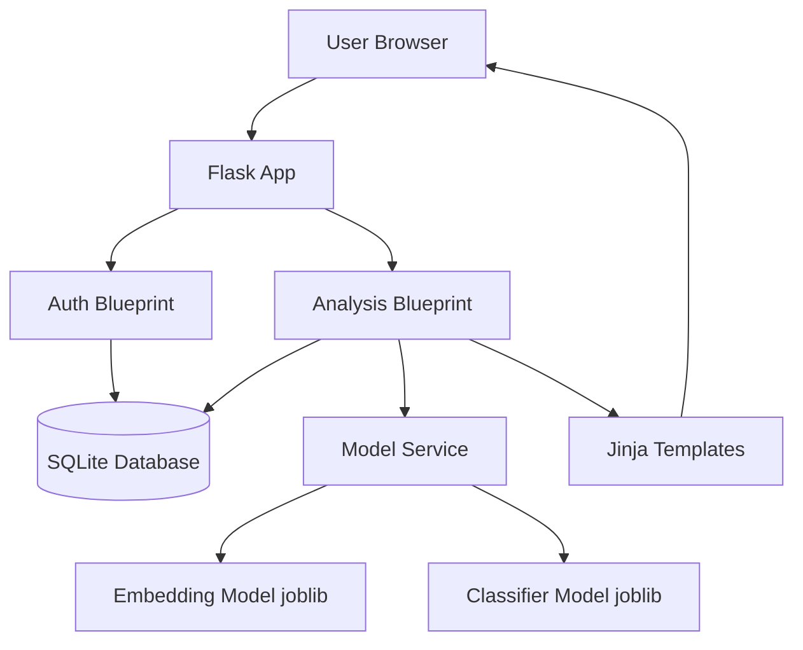

# CognAware AI — Complete System Documentation

## 1) Project Overview

CognAware AI is a Flask-based mental wellness assistant that helps users identify cognitive distortions in their thoughts.

The system provides:
- User authentication (register, login, logout)
- Thought submission and ML-based distortion prediction
- Top-3 distortion visualization with confidence signal
- Historical thought tracking per user
- Dedicated analysis result page with trend insights

The goal is not to diagnose mental illness, but to support self-reflection using NLP-based pattern detection.

---

## 2) Core Problem Statement

Many users find it difficult to identify distorted thinking patterns in daily thoughts. This project solves that by:
- Detecting six predefined cognitive distortion classes
- Returning probability scores for each class
- Showing top patterns and their confidence
- Highlighting trend movement across historical entries

---

## 3) High-Level Architecture



### Architecture Layers
- Presentation Layer: Jinja templates + CSS + lightweight frontend JS for chart bars
- Application Layer: Flask app + blueprints + route handlers
- Service Layer: ML inference and probability normalization
- Persistence Layer: SQLite database via SQLAlchemy
- Model Artifacts: Pretrained embedding + classifier joblib files

---

## 4) Project Structure

```text
backend/
	app.py
	config.py
	database/
		db_init.py
	models/
		user.py
		thought.py
		distortion_classifier.joblib
		embedding_model.joblib
	routes/
		auth_routes.py
		analysis_routes.py
	services/
		model_service.py

frontend/
	templates/
		base.html
		home.html
		login.html
		register.html
		dashboard.html
		analysis_result.html
	static/
		style.css

training/
	dataset.csv
	distortion_training.ipynb
```

---

## 5) Technology Stack

- Backend: Flask
- Authentication: Flask-Login
- ORM/Database: Flask-SQLAlchemy + SQLite
- ML Runtime: scikit-learn model artifacts loaded with joblib
- Numerical processing: NumPy
- Frontend: HTML (Jinja), CSS, minimal JavaScript

---

## 6) Detailed Backend Design

### 6.1 Flask App Initialization
File: backend/app.py

Responsibilities:
- Creates Flask app with template/static folders mapped to frontend/
- Configures secret key and SQLite DB path
- Initializes SQLAlchemy
- Initializes Flask-Login and user loader
- Registers blueprints: auth and analysis
- Ensures tables are created at startup

Key factory function:
- create_app() -> Flask

---

### 6.2 Database Layer

#### db_init.py
- Exposes global SQLAlchemy instance: db

#### User Model (models/user.py)
Columns:
- id (PK)
- name
- email (unique, indexed)
- password_hash
- created_at

Methods:
- set_password(password): hashes with werkzeug
- check_password(password): verifies hash

#### Thought Model (models/thought.py)
Columns:
- id (PK)
- user_id (FK -> users.id)
- text (original thought)
- results (JSON string containing prediction payload)
- created_at

---

### 6.3 Authentication Blueprint
File: backend/routes/auth_routes.py

Routes:
- GET /
	- If authenticated -> redirect to /dashboard
	- Else -> render home page

- GET/POST /register
	- Validates name/email/password
	- Checks duplicate email
	- Creates user, hashes password, logs in, redirects dashboard

- GET/POST /login
	- Validates credentials
	- Logs in user
	- Supports safe next URL redirect

- GET /logout
	- Requires login
	- Logs out and redirects to home

Security note:
- _is_safe_next_url() prevents open redirect issues by validating same-host next URLs.

---

### 6.4 Analysis Blueprint
File: backend/routes/analysis_routes.py

#### Utility: _build_dashboard_prediction(results_payload)
Purpose:
- Normalizes prediction payload from DB
- Guarantees complete probability keys for all distortion labels
- Builds sorted list + top3 list + confidence label
- Handles malformed or partial JSON safely

Output fields include:
- probabilities
- sorted_distortions
- top_distortions
- max_probability
- high_confidence
- confidence_label

#### Utility: _build_pattern_insight(thought_predictions)
Purpose:
- Computes pattern trend only when enough data exists (>=4 entries)
- Splits history into earlier/recent halves
- Finds most frequent average distortion class
- Computes change percentage in mean intensity
- Returns trend: increasing/decreasing/stable

#### Route: /dashboard (GET/POST)
POST flow:
1. Reads thought text from form
2. Calls analyze_thought()
3. Stores result JSON in thoughts table
4. Redirects back to dashboard with flash message

GET flow:
1. Loads user thought history (latest first)
2. Parses JSON safely per thought
3. Normalizes via _build_dashboard_prediction()
4. Sends thought history to template

#### Route: /analysis/result/<thought_id>
Purpose:
- Dedicated detail page for one historical thought
- User-scoped fetch (prevents access to others’ data)
- Computes per-user historical metrics:
	- current_score
	- previous_avg
	- overall_avg
	- trend status
	- most_frequent_distortion
	- history_length
- Also computes broader pattern_insight

---

## 7) ML Service Design
File: backend/services/model_service.py

### 7.1 Distortion Labels
System currently predicts exactly 6 classes:
- overgeneralization
- catastrophizing
- mind_reading
- emotional_reasoning
- black_white_thinking
- personalization

### 7.2 Model Loading
- Classifier artifact: backend/models/distortion_classifier.joblib
- Embedding artifact: backend/models/embedding_model.joblib

At import time:
- Tries loading both models
- Logs failure and keeps objects None if loading fails

### 7.3 Embedding Generation
_generate_embedding(text):
- Uses encode() when available
- Falls back to transform() when needed
- Supports sparse -> dense conversion

### 7.4 Inference Function
analyze_thought(text):
1. Validates model availability
2. Generates and reshapes embedding safely
3. Validates feature dimension against classifier expectation
4. Runs predict_proba
5. Handles multiple output shapes (list/2D/3D/1D)
6. Maps probabilities robustly to labels
7. Computes:
	 - sorted_distortions
	 - top_distortions (top 3)
	 - max_probability
	 - confidence_label:
		 - >= 0.25 -> Strong Signal
		 - >= 0.10 -> Moderate Signal
		 - else -> Mild Signal

### 7.5 Debug Utilities
- debug_model_status(): estimator fitting and coefficient diagnostics
- debug_prediction_verification(): sanity checks on sample sentences

---

## 8) Frontend / UI Design

### 8.1 Base Layout
File: frontend/templates/base.html

Features:
- Shared site header and navigation
- Auth-state aware action buttons
- Flash message stack
- Reusable page content block

### 8.2 Pages

#### home.html
- Product introduction
- Distortion explanation cards
- How-it-works steps
- CTA buttons to login/dashboard/register

#### login.html / register.html
- Clean auth forms
- Server-side flash message driven feedback

#### dashboard.html
- Thought submission form
- History cards with:
	- thought text
	- confidence label
	- top 3 distortion bars
	- link to detail page

#### analysis_result.html
- Thought snapshot
- Top distortion chart bars
- Cognitive trend comparison chart (current vs previous avg vs overall avg)
- Pattern insight block
- Back-to-dashboard action

### 8.3 Styling
File: frontend/static/style.css

Design system:
- Warm pastel palette
- Reusable card and spacing tokens
- Distortion color tags
- Responsive breakpoints
- Sticky header and improved nav layout

---

## 9) Data Flow (End-to-End)

```text
User submits thought
	-> /dashboard POST
	-> analyze_thought()
	-> prediction payload generated
	-> thought + payload saved in DB
	-> redirect /dashboard
	-> history renders top distortions
	-> user clicks "View Result"
	-> /analysis/result/<thought_id>
	-> trend + pattern analytics computed
	-> result page with chart-style bars
```

---

## 10) Error Handling & Resilience

- Invalid or empty thought input handled with warnings
- ML inference exceptions logged and surfaced as user-safe flash messages
- Corrupt JSON in DB gracefully handled with fallback defaults
- Missing/unauthorized thought_id safely redirects to dashboard
- Probability normalization ensures all six labels are always present in UI payloads

---

## 11) Security Considerations

- Passwords are hashed (never stored plaintext)
- Protected pages require authentication
- next URL validation reduces open-redirect risk
- User-scoped thought access prevents cross-user data leakage

Production recommendations:
- Replace default SECRET_KEY with strong environment variable
- Disable debug mode in production
- Move from SQLite to PostgreSQL for concurrent multi-user deployment
- Add CSRF protection (Flask-WTF) for form safety

---

## 12) Setup and Run Guide

### 12.1 Prerequisites
- Python 3.9+
- Virtual environment (recommended)

### 12.2 Install Dependencies

```bash
pip install flask flask-login flask-sqlalchemy joblib numpy scikit-learn
```

If your embedding artifact depends on sentence-transformers or similar package, install that package too.

### 12.3 Run Application

```bash
python backend/app.py
```

Default local URL:
- http://127.0.0.1:5000/

---

## 13) API / Route Map

Public routes:
- GET /
- GET/POST /login
- GET/POST /register

Authenticated routes:
- GET /logout
- GET/POST /dashboard
- GET /analysis/result/<int:thought_id>

---

## 14) Training Assets

Location:
- training/dataset.csv
- training/distortion_training.ipynb

Current runtime uses pre-exported joblib artifacts inside backend/models.

If retraining is performed:
1. Train in notebook
2. Export classifier + embedding artifacts
3. Replace model files in backend/models
4. Restart app

---

## 15) Known Limitations

- No crisis/self-harm intervention banner logic yet
- SQLite is not ideal for high concurrency
- Some debug prints are still present in route handlers
- No automated test suite currently committed

---

## 16) Suggested Next Enhancements

- Add unit/integration tests (auth, model-service, routes)
- Add CSRF protection and stricter form validation
- Add explicit real chart library (e.g., Chart.js) for trend timeline plotting
- Add model/version metadata display in admin/debug page
- Add Dockerfile + production WSGI server setup

---

## 17) Conclusion

CognAware AI is now a complete full-stack prototype with secure auth flow, robust ML inference integration, normalized prediction handling, historical analysis, and a modern chart-oriented UI. The system is suitable for academic submission, demo deployment, and further research iteration.

---

## 18) Hackathon Judging Alignment (Quick Reference)

### 18.1 Assessment Criteria Mapping

1. Concept (15)
- Solves real mental wellness reflection problem with explainable output.

2. Originality (15)
- Combines distortion detection + trend history + AI reframe suggestion + safety alerting in one flow.

3. Degree of Difficulty (15)
- End-to-end pipeline: auth, ML inference, probability normalization, persistent history, trend analytics.

4. Workmanship (10)
- Structured Flask architecture, reusable templates, robust fallback handling for malformed data.

5. Presentation (10)
- Demo-ready dashboard and result visualizations with clear, interpretable cards and charts.

6. Usability Perspective (10)
- Simple user journey: submit thought -> view top patterns -> view trend -> receive reframe.

7. UI-UX (5)
- Responsive card-based UI, chart bars, readable confidence markers, quick navigation.

8. Safety Consideration (10)
- Keyword-based high/moderate risk detection and support alert block with helpline guidance.

9. Scope Management (5)
- MVP-first implementation with clear boundaries and prioritized features.

10. Operational Guide (5)
- One-command local run, route map, known limitations, enhancement roadmap included.

---

## 19) 2-Minute Demo Script (Use in Final Presentation)

### 0:00–0:20 | Problem
"People often experience cognitive distortions but cannot identify them quickly. CognAware AI gives immediate, explainable reflection support."

### 0:20–0:45 | Live Flow
1. Log in.
2. Submit one thought in dashboard.
3. Show top 3 distortion chart and confidence signal.

### 0:45–1:20 | Intelligence Layer
1. Open "View Result".
2. Show cognitive trend chart: current vs previous avg vs overall avg.
3. Show AI reframe suggestion (challenge question + balanced reframe).

### 1:20–1:40 | Safety Layer
1. Enter a risky sample thought.
2. Show safety support alert and helpline recommendation.

### 1:40–2:00 | Closing Value
"This is an explainable, user-focused MVP that is practical today and extensible for production with stronger safety and clinical collaboration."

---

## 20) Quick Judge FAQs (Suggested Answers)

Q: Why is this not just a sentiment model?
- Because we classify specific cognitive distortion patterns and show interpretable category-level probabilities.

Q: What makes this usable?
- Users can track history, compare trends, and receive immediate reframing prompts, not just raw scores.

Q: What is your safety strategy?
- We provide risk phrase detection, alerting, and support guidance. This is a support tool, not emergency replacement.

Q: How can this scale?
- Replace SQLite with PostgreSQL, deploy behind WSGI, and add model monitoring/versioning.

